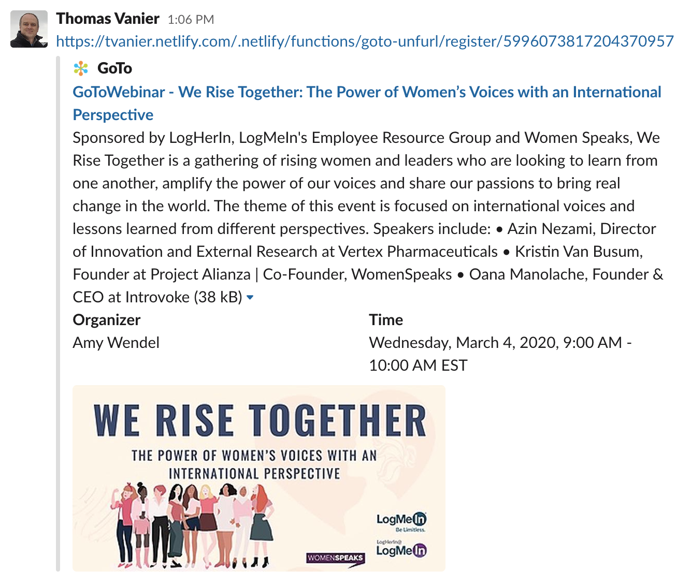

# GoTo Unfurl

This repository contains a Javascript function to "unfurl" GoTo join and registration links. From a meeting id, name or a webinar key, the function fetches the meeting/webinar organizer and session details, and returns html tags parsed by social media.

Example of unfurled join link in Slack:<br>


See below other examples.

The function returns tags as documented in the "classic unfurling" section of this Slack doc
https://api.slack.com/docs/message-link-unfurling

The function is currently deployed on Netlify at `https://tvanier.netlify.com/.netlify/functions/goto-unfurl`

## Supported paths

`/join/{meeting-id}` where `{meeting-id}` is either
- a 9-digit id such as `123456789`
- a meeting room name such as `tvanier`

`/register/{webinar-key}` where `{webinar-key}` is a webinar key, usually 18 or more characters

## Implementation

The current function implementation depends on Node.js version 10 or greater. There is no other dependency.
The whole function code is in `goto-unfurl.js`, which currently
- works against the G2M production environment (no ED, RC etc)
- fetches images (ex: logo) from `tvanier.netlify.com`
- is meant to be deployed on Netlify as documented here
https://docs.netlify.com/functions/overview/

## Testing

The function can be tested locally by running the `test.js` script, which takes a path as first argument. Examples:
```
node test.js /join/753869749

node test.js /register/4992149326305460236
```

The test script prints the function return to the console.

When deploying to a cloud, like Netlify for example, the function can be invoked with utilities like curl:

```
curl https://tvanier.netlify.com/.netlify/functions/goto-unfurl/join/753869749

curl https://tvanier.netlify.com/.netlify/functions/goto-unfurl/register/4992149326305460236
```

End-to-end testing can be perfomed by sharing links in social media. In Slack, it is possible to send links to yourself.

The links should also work in other media such as Facebook and Twitter (not tested).

## Examples

#### Webinar registration link in Slack


