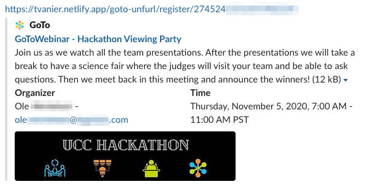

GoTo Unfurl

This repository contains a function to "unfurl" GoTo join and registration links.

Example of unfurled join link:


See below other examples.

The function is currently deployed on Netlify at `https://tvanier.netlify.com/.netlify/functions/goto-unfurl`

## Supported paths

`/join/{meeting-id}` where `{meeting-id}` is either
- a 9-digit id such as `123456789`
- a meeting room name such as `tvanier`

`/register/{webinar-key}` where `{webinar-key}` is a webinar key, usually 18 or more characters

## Implementation

The current function implementation depends on Node.js version 10 or greater. There is no other dependency.

## Testing

The function can be tested locally by running the `test.js` script, which takes a path as first argument. Examples:
```
node test.js /join/753869749

node test.js /register/4992149326305460236
```

The test script prints the function return to the console.

When deploying to a cloud, like Netlify for example, the function can be invoked with utilities like curl:

```
curl https://tvanier.netlify.com/.netlify/functions/goto-unfurl/join/753869749

curl https://tvanier.netlify.com/.netlify/functions/goto-unfurl/register/4992149326305460236
```

End-to-end testing can be perfomed by sharing links in social media. In Slack, it is possible to send links to yourself.

The links should also work in other media such as Facebook and Twitter (not tested).

## Examples

#### Webinar registration link in Slack
